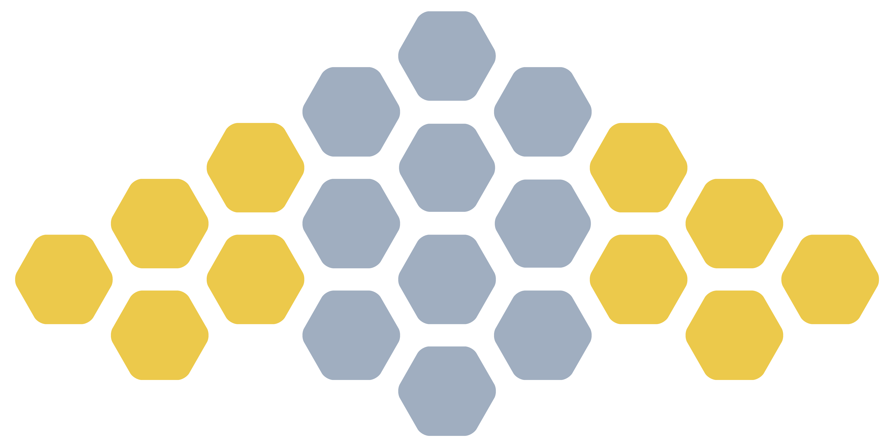

    

bee.limo
========

A word game based on [Spelling Bee](https://www.nytimes.com/puzzles/spelling-bee) from the _New York Times_ crossword—and when I say “based on,” I mean it’s an exact copy of that game. I built it as a learning exercise, please don’t sue me.

Built with Laravel, Svelte, and Tailwind.

Play at [bee.limo](https://bee.limo).
